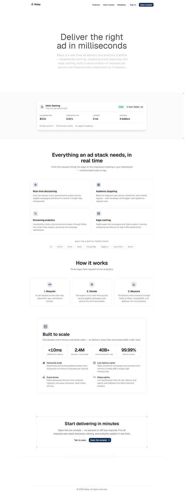
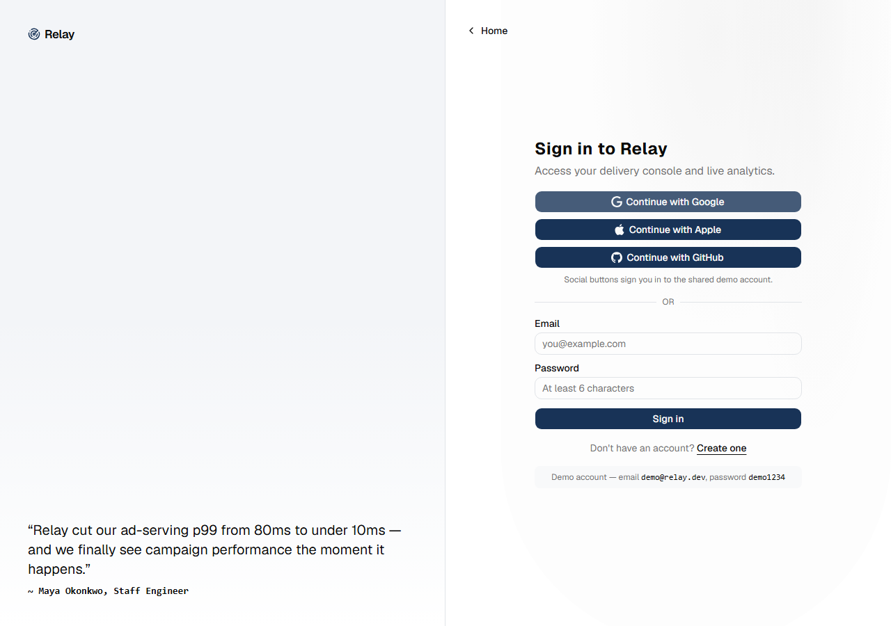
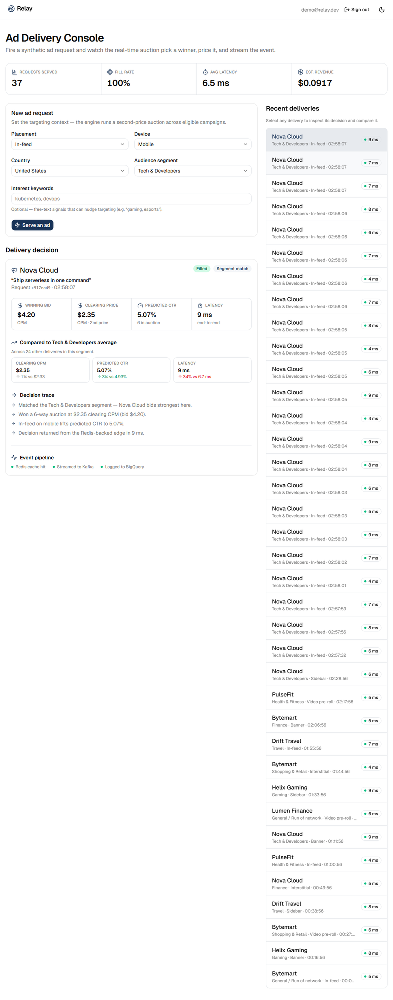

# Relay — Real-Time Ad Delivery & Analytics

Relay is a real-time ad delivery and analytics platform: it serves targeted ads in
single-digit milliseconds and measures every impression as it happens. This is a
full-stack demo — a React web app plus an API server with real accounts, a database,
and a server-side ad auction — so you can run the whole flow from sign-up to serving
ads and watching the analytics update.

> Portfolio / demo project. Advertisers, campaigns and traffic are fictional, and the
> Kafka/Redis/BigQuery pipeline flags are illustrative (the auction and persistence are
> real; the streaming infra is represented, not run).



---

## Contents

- [What it does](#what-it-does)
- [Screenshots](#screenshots)
- [Architecture](#architecture)
- [Tech stack](#tech-stack)
- [Getting started](#getting-started)
- [Demo script (sign-up to serving ads)](#demo-script-sign-up-to-serving-ads)
- [Project structure](#project-structure)
- [Configuration](#configuration)
- [API](#api)
- [License](#license)

---

## What it does

The product idea: a backend platform that **delivers targeted ads and tracks campaign
performance in real time**, built on distributed, event-driven infrastructure (Go,
Python, Kafka, Redis, PostgreSQL, BigQuery, Kubernetes, Docker).

This repo implements a working slice of that:

- **Accounts** — sign up, sign in, or use a one-click demo account (JWT auth, bcrypt
  password hashing).
- **Real-time decisioning** — each ad request runs a second-price auction across
  eligible campaigns on the server and returns a winner in single-digit milliseconds.
- **Audience targeting** — matches on segment, geo, device, placement, and free-text
  interest signals, with per-campaign geo eligibility.
- **Streaming analytics** — every delivery is persisted and the console's KPIs
  (requests served, fill rate, average latency, estimated revenue) update live.
- **Pipeline visibility** — each decision reports its downstream side-effects: Redis
  cache hit/miss, streamed to Kafka, logged to BigQuery.

## Screenshots

| Sign in / sign up | Ad Delivery Console |
| --- | --- |
|  |  |

## Architecture

Two parts in this repo:

```
Browser (React, Vite)  ──HTTP/JSON + JWT──►  API server (Express)
   /  /auth  /app                               │
                                                ├─ auth  (signup / login / demo)
                                                ├─ serve (real-time auction)
                                                └─ deliveries (history)
                                                       │
                                                  SQLite (node:sqlite)
                                            users · campaigns · deliveries
```

- The **frontend** (`/src`) handles routing, the marketing site, auth screens, and the
  Ad Delivery Console. `/app` is gated behind sign-in.
- The **API server** (`/server`) owns accounts, the campaign catalog, the auction
  engine, and delivery history. It uses Node's built-in SQLite driver, so there is
  **no external database to install** — the `.db` file is created and seeded on first run.
- Auth is a JWT stored in the browser and sent as a Bearer token on protected calls.

## Tech stack

**Frontend**
- React 19 + TypeScript, Vite
- Tailwind CSS v4 (`radix-nova` shadcn style), @efferd UI blocks
- React Router, next-themes (light/dark), Motion, lucide-react, Geist

**Backend**
- Node.js 22+ with the built-in `node:sqlite` database (zero native deps)
- Express, JSON Web Tokens, bcrypt (`bcryptjs`)

The broader platform targets Go/Python services with Kafka, Redis, PostgreSQL and
BigQuery on Kubernetes; this demo represents that pipeline rather than running it.

## Getting started

Prerequisites: **Node.js 22.5+** and npm (Node 22.5+ is required for `node:sqlite`).

```bash
npm run setup    # installs both the web app and the server
npm run dev      # runs the web app (http://localhost:5173) and API (http://localhost:8787)
```

Then open http://localhost:5173 and either create an account or use the demo account:

```
email:    demo@relay.dev
password: demo1234
```

Run the two processes separately if you prefer:

```bash
npm run dev:web      # frontend only
npm run dev:server   # API only
```

Build / preview the frontend:

```bash
npm run build        # type-checks (tsc) and bundles to dist/
npm run preview
```

## Demo script (sign-up to serving ads)

1. **Landing** ( `/` ) — scroll (the header stays pinned), toggle light/dark, then click
   **Sign In** or **Open console**.
2. **Sign up / sign in** ( `/auth` ) — create an account with email + password, click a
   social button for the one-click demo account, or sign in with `demo@relay.dev` /
   `demo1234`. New accounts start with empty analytics; the demo account comes with
   seeded history.
3. **Ad Delivery Console** ( `/app` ) — choose a targeting context (placement, device,
   country, segment, optional interests) and click **Serve an ad**. Inspect the winning
   campaign, the second-price clearing CPM, the predicted CTR, the latency, the decision
   trace, and the Redis/Kafka/BigQuery flags. The KPI strip and **Recent deliveries**
   update on every serve, and persist (they are stored server-side per account).
   - Click any item in **Recent deliveries** to inspect that delivery's decision and
     metrics, with a comparison of its clearing CPM, CTR, and latency against the
     average for its audience segment.
4. **Sign out** from the console header; visiting `/app` again redirects to `/auth`.

Things to try:
- Segment **Gaming** → *Helix Gaming* tends to win; **Finance** in the **US** →
  *Lumen Finance* competes; **Finance** in **Japan** → Lumen is geo-restricted, so a
  different ad wins (geo targeting).
- Serve several requests, reload, sign out and back in — history persists per account.

## Project structure

```
.
├── src/                         # React frontend
│   ├── App.tsx                  # routes + RequireAuth guard for /app
│   ├── pages/                   # landing-page, console-page
│   ├── components/              # hero, features, auth-page, console widgets, ui/
│   └── lib/
│       ├── api.ts               # HTTP client (auth + serving)
│       ├── auth.tsx             # AuthProvider / useAuth
│       └── types.ts             # shared request/response contract
└── server/                      # API server
    └── src/
        ├── index.js             # Express app + routes
        ├── db.js                # node:sqlite schema + seed (campaigns, demo data)
        └── auction.js           # second-price decisioning engine
```

## Configuration

Frontend (`.env.local`, optional):

| Variable       | Default                 | Effect                                   |
| -------------- | ----------------------- | ---------------------------------------- |
| `VITE_API_URL` | `http://localhost:8787` | Base URL of the API server.              |

Server (environment variables, all optional — see `server/.env.example`):

| Variable      | Default                    | Effect                          |
| ------------- | -------------------------- | ------------------------------- |
| `PORT`        | `8787`                     | API port.                       |
| `CORS_ORIGIN` | `http://localhost:5173`    | Allowed browser origin.         |
| `JWT_SECRET`  | dev placeholder            | Token signing secret (set this in production). |
| `DB_PATH`     | `server/relay.db`          | SQLite file location.           |

## API

| Method & path              | Auth | Body / returns                       |
| -------------------------- | ---- | ------------------------------------ |
| `POST /api/auth/signup`    | no   | `{email,password,name?}` → `{token,user}` |
| `POST /api/auth/login`     | no   | `{email,password}` → `{token,user}`  |
| `POST /api/auth/demo`      | no   | → `{token,user}` (shared demo account) |
| `GET  /api/me`             | yes  | → `{user}`                           |
| `POST /api/serve`          | yes  | `AdRequest` → `DeliveryResponse`     |
| `GET  /api/deliveries`     | yes  | → `SavedDeliveryRecord[]`            |
| `GET  /api/deliveries/:id` | yes  | → `SavedDeliveryRecord`             |

Request/response shapes are defined in `src/lib/types.ts`.

## License

MIT — see [LICENSE](LICENSE). Advertisers, campaigns and metrics are fictional, for
demonstration only.
